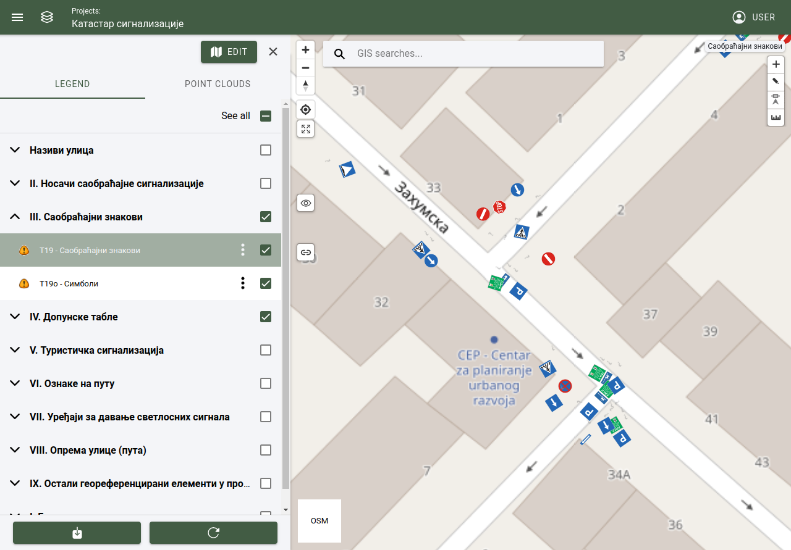

2D digitizing tools
====================

Select active layer from map legend
-----------------------------------

Layers are represented in layer groups. A layer can be set as active layer, when a layer group is opened an a layer is selected from the list (clicked on the layer's name). Toolbar will apear inside the map view's upper right corner alog with active layer's name.

Add new feature
---------------

Adding an object's is possible, when the active layer is set. To add an object, select the "+" tool from the toolbar.

Actions:

* Drawing and object is done by activating the tool and clicking on the map.
* To finishing drawing the new object simply double click on the object's last point on the map. (when drawing a point object, single clicking on the map is enough, double clicking is necessary only when drawing an object with multiple points like lines or poligons)

.. tip:: For example, when drawing a line object which contains of 3 points, draw the first and sercond point and when drawing the third point double click to finish the object.

Edit existing feature
---------------------

Editing an object's is possible, when the active layer is set. To edit an object, select the "pencil" tool from the toolbar.

Actions:

* On the map, select an object to activate it.
* Click on the object again to edit its points.
* Click and drag the endpoints to relocate.

* Click and drag the lines to breake and create additional endpoints.

* To save the edited object click on the "save" tool (this will save the new position of the object) or on the "open form" tool (this will open the object's form, and additional parameters can be modified).

Delete feature
--------------

To remove an object, object must be selected on the 2D map. When the object is selected, object can be removed through the objects form by selecting the remove button.

Undo / redo
-----------

Undo or redo tool is active when add or edit tool is selected.

Actions:

* Undo: Undo an action.
* Redo: Redo an action.

Snapping
---------

Snap to vertex tool can be activated or deactivated. When drawing an object, and the pointer is near to another object, it will jump or snap to the other object's point. Snap to vertex can be used when an object is edited or a new is created.

Snap tool types:

* Line: Pointer snaps to the object's line.
* Vertex: Pointer snaps to the object's point.
* Line and vertex: Pointer snaps to the object's lines and points.

Open attribute form
-------------------

When an object is selected from the map, object's attributes are opened and displayed in the attribute form. Object's data can be changed and saved.

:ref:`Attribute form <attribute_form>`