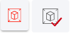

3D digitizing tools
===================

.. _3d_digitizing:

.. tip:: use document **User manual - Point cloud**

3D digitalizing tools are used to create precisely defined objects on the point cloud map, by creating relations between the cloud's points.

.. note:: Digitalization tools that are for creating or editing features are available when the active layer is set.

View modes
----------

There are 4 map view modes and 6 camera view modes.

Map view modes:

* Bird eye view: User's point of view is set to free, camera can be moved, rotated zoomed freely on the point cloud map.
* Panorama spherical view: User's point of view is placed to the nearest panorama sphere. A panorma image is displayed, the camera can be rotated freely, zoom is limited.
* Point cloud spherical view: User's point of view is placed to the nearest panorama sphere, only point cloud points are displayed. Camera can be rotated freely, zoom is limited.
* Combined spherical view: User's point of view is placed to the nearest panorama sphere, combined view is used with point clud and panorama image. Camera can be rotated freely, zoom is limited.

User view of the point cloud map is rotated to its predifined views:

* Left side view
* Right side view
* Front side view
* Back side view
* Top side view
* Bottom side view

Settings
--------

Settings of the point cloud map can be set.

Actions:

* Panorama spheres: Show or hides the panorama spheres on the point cloud map.
* Opacity: Changes the opacity of the point cloud points.
* Size of points: Changes the size of points on the point cloud map.
* Point budget [Million]: Changes the number of rendered points on the point cloud map.
* Colored points clouds (material): Change the coloring of the point cloud map.
* Brightness: Changes the brightness of the points on the point cloud map.
* Contrast: Changes the contrast of the points on the point cloud map.
* Gamma: Changes the gamma of the points on the point cloud map.

Measurement tools
-----------------

Measurement tools are used to measure lenght, distance, height, area, angle on the point cloud map. Measurement is done between point, (minimum of two) that are set on the point cloud map.

Tools:

* Measurement of distance: Distance is measured between points, multiple points can be set.
* Measurement of height: Measurement is done between point, distance is measured only vertically.
* Measurement of distance on horizontal plane: Measurement is done between point, distance is measured only horizontally.
* Measurement of area: Area is measured between minimum of there points.
* Measurement of angle: Angle is measured between 3 points.
* Measurement of angle facing north: Angle is measured between 3 points. When the first point is placed, a second point is placed on the map facing north, and the third point can be placed.

Add new feature
---------------

When the add tool is active, drawing a new object is possible on the point cloud map, when a layer is set as active layer. By default the add tool can be activated with the button "e".

.. note:: The new object's type, depends on the active layer's type. It can be point, line or poligon.

Edit existing feature
---------------------

When the edit tool is active, objects on the point cloud map are selectable. Selected objects can be edited (add new points, remove, change parameters on form, etc.). By default the edit tool can be activated with button "r". Edited points can be moved on selected axis. (button "x")

Actions:

* Left click on object (single click): First click selects the object. (point, line, polygon) Other objects cant be selected until the current object is deselected.
* When the object is selected:
* Position of the edited object's point can be changed along x, y, z axes.
* Add new point to the end of the object. (ctrl + click on line of the object)
* Add new point on the line of the object. (between existing points) (shift
* click on the line of the object)
* Remove object points: Remove points of the selected object. (buttons "delete" or "d")
* Active object edit can be deactivated with button "esc".

* Layer selection: Selected layer (active layer):
* When another layer is selected, active drawn object can be saved, removed, or continued.
* Save parameters: Parameters can be saved through "open form" tool or when the "space" button is pressed.
* Shortcuts: More information about shortcuts under section "Shortcuts".

Follow drawing
--------------

Follow drawing tool can be activated alongside with the add or edit tool. When the tool is activated and drawing on the point cloud map, camera will be focused on the newly drawn or edit object's points.

Undo / redo
-----------

Undo or redo tool is active when add or edit tool is selected.

Actions:

* Undo: Undo an action.
* Redo: Redo an action.

Delete feature
--------------

Delete tool is active when an object is selected in the point cloud map.

Actions:

* Remove object: Remove selected object.

Copy / paste feature
--------------------

Tool can be used with the edit tool. When an object is selected on the point cloud map, the tool can be activated. When clicked on the copy tool, the paste tool activates. When clicked on the paste tool the mouse cursor changes to a cross. In this state the copied object can be pasted on the point colud map.

Join line features
------------------

Tool can be used with the edit tool. When an object is selected it changes to color yellow, then another object can be selected by pressing the ctrl button on the keyboard and selecting it on the point cloud map. The second object will change its color to green. Then the join line tool is activated. When used the user will be asked to join the two objects. When it is accepted the first object's geometry will be changed and the second object will be removed.

Snapping
---------

Snap to vertex tool can be activated or deactivated. When drawing an object, and the pointer is near to another object, it will jump or snap to the other object's point. Snap to vertex can be used when an object is edited or a new is created.

Snap tool types:

* Line: Pointer snaps to the object's line.
* Vertex: Pointer snaps to the object's point.
* Line and vertex: Pointer snaps to the object's lines and points.

Open attribute form
-------------------

Form can be opened with open object's form tool. When the form is opened it is filled with fields where the object's parameter can be changed. (by default form can be opened with "space" button)

Actions on form:

#. Data: Fields where the object parameters can be set or changed.
#. Cancel: Cancel and close object popup window.
#. Save and close: Save object's parameters and close the object's form popup.
#. Save: Save object's parameters.
#. Delete: Remove selected object.
#. Object attachments: Photos and attachments can be managed.

More info about the object form can be read here. :ref:`Attribute form <attribute_form>`

Clipbox
-------

Clipbox tool is used to clip a selected part of the point cloud map. When the clipbox is set, only the clipped part is visible, other parts of the point cloud map will be hidden. This tool make the work easier, and concentrates on a limited section of the point coud map.

Actions:

* Clipbox checkmark button: Activates the the tool. To use it, click on the desired part of the point cloud map and press the left mouse button to place the clipbox marker.
* Tool options:
    * Scale clipbox: Clipbox can be scaled verticaly or horizontaly by proportions.
    * Scale clipbox by the axis: Clipbox can be scaled by the x, y, z axis.
    * Rotate clipbox: Clipbox can be rotated by the x, y, z axis.
    * Move clipbox: Clipbox can be moved by the x, y, z axis.
    * Activate clip: Activate the clipbox, showing only the selected part.
        * Return to active clipping: Only available when the clipbox is activated, the point cloud is returned to its original state, and the tool stays active, and can be used again.
        * Cancel clipping: Only available when the clipbox is activated, cancels the clipping the point cloud map returns to its original state and deactivated the clipbox tool.
    * Deactivates Cancel clip: Deactivates the clipbox tool.

Shortcuts
---------

Shortcuts are used on the point cloud map. They are useful when objects are added or edited.
More info about shortcuts can be read here. :ref:`Shortcuts <shortcuts>`