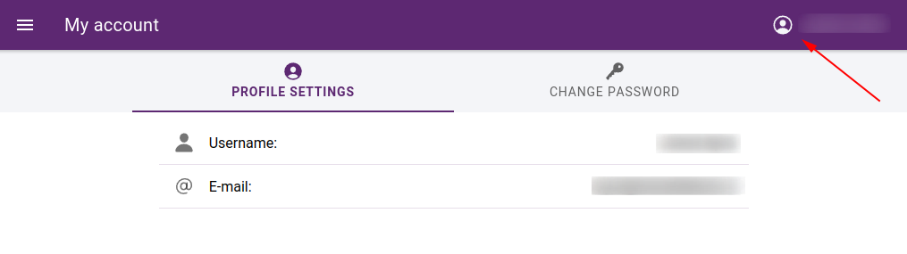

User account
============

Login
-----

Users can log in by entering their email address and password. Users are registered on the administration page by an administrator.
When configuring the application, it is possible to allow users to log in with a Google or Facebook account. This should be used when setting up WebGIS portals where external users can access certain services, e.g. reporting bugs, posting comments, etc.

.. figure:: images/Login.png
   :name: login
   :align: center

   Login

My account
----------

On the account page you can view the basic details of the logged in user and change the password.

   My account
