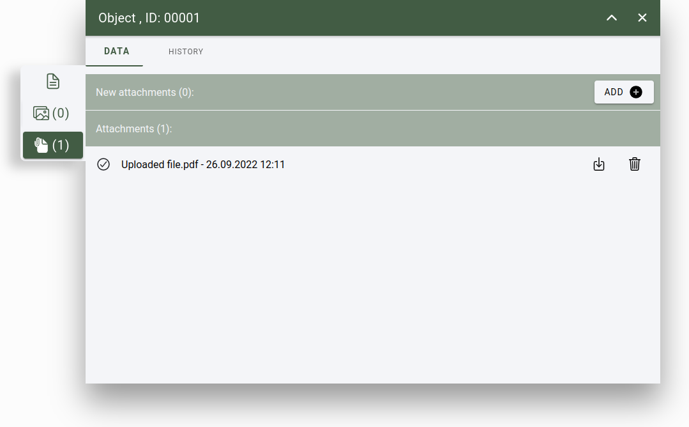

.. _attribute_form:
Attribute form
==============

Object's attributes and parameters can be edited on the attribute from.

    Object's attribute form

.. note:: Layer object actions are tied to user permissions.

Open form
---------

The form can be opened from multiple places:

* by selecting an object from the 2D map;
* by selecting an object and with the open form tool;
* from table with the open form button.

Mandatory, important fields
---------------------------

In the object's from, fields that are marked with:

* Marked with red: Mandatory fields, they must be filled to save the object's parameters.
* Marked with yellow: Not a mandatory fields, but they are important.
* Marked with no color: Object can be saved without filling these fields.

:ref:`Lookup tables <lookups>`

Geolocation, automatic fields
-----------------------------

Attach images
-------------

Additional images can be attached to the object. It can be uploaded from the users computer, or if the user uses from a mobile device camera photo can be uploaded, or it can be generated from the - if available - nearby panoramic images.

    Attribute form, image manager

Actions:

* Add photo: An image can be selected and prepared for upload. Multiple images can be prepared for upload.
* Select a system generated image from panoramic images nearby: The system can generated panoramic images by setting the min and max distance, rotation and the number of generated. When the parameters are set a list of images are generated (defined by the "number of images" parameter). From the list a single image can be selected for upload.
* Crop: When the image is selected, it can be cropped. Set the cropping rectangle to the desired width and height and press the "crop" button. To reset the cropping, press the "X" button.

* Cancel: Cancel the upload and close the attribute form.
* Upload: Starts the upload procedure. After the image is uploaded successfully a new image upload can be made when the "+" button is pressed in the image slider, or the selected image can be removed.
* Restart: Return to the add photo phase and a new image can be prepared.
* Add new image: A new image can be selected and prepared for upload.

    List of uploaded images

Attach documents
----------------

Additional files, documents can be attached to the object. It can be uploaded from the users computer.

    Attribute form, file manager

Actions:

* Add: A file can be selected and prepared for upload. Multiple files can be prepared for upload.
* Upload: Start the upload process.
* Remove file: At the end of the row there is an "X" button to remove prepared file from upload. When all files are removed, the upload button will be hidden.

    List of uploaded files