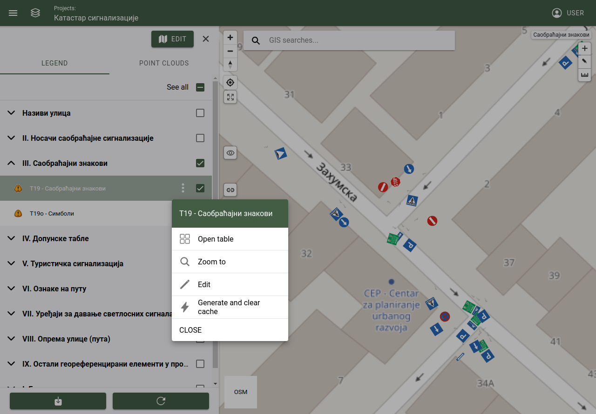
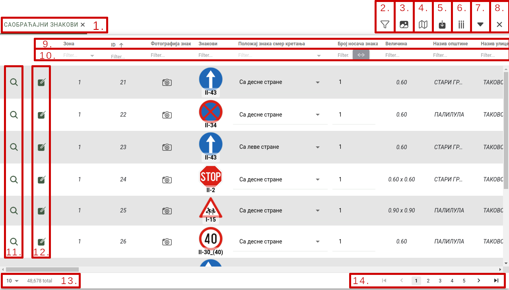

Attribute table
===============

Objects are displayed mainly on the 2D map, but there is an option to display object's attributes arranged in a table view. To open a layer's objects in the table view in the legend, open a layer group, and the layer's more option select the option "open in table".

Table actions
-------------

**multiple layer feature tabs**

When multiple layers are opened, it's objects attributes are displayed in tabs. Tabs can be selected to change which layer content is displayed or it can be closed.

**Filtering content by polygon selection**

By selecting the tool polygon filtering, drawing will be activated, and a polygon can be drawn on the 2D map. Table data will be filtered acording to the drawn polygon, only those objects will be displayed in the table, which are inside the drawn polygon.

Actions:

* Polygon selection: Turns on the tool, drawing is activated on the 2D map and it can finish by double clicking on the map.
* Cancel selection: Turns off the tool, clear the filter from the map and table.

**Compact view**

By selecting the tool (turning on and off) table rows will be adjusted to its minimal height. If table rows contains images (with lables) they will be reduced to fit the table rows.

**Filter map with table data**

By selecting the tool (turning on and off) the 2D map will be filtered by the table data. If table data is already filtered, map will be filter accordingly.

**Export table data**

By selecting this tool exporting data from table is possible.

Settings:

* Content of export: Layers, images, attachments.
* Methode of download: Download can be executed immediately, or scheduled. Scheduled exports are placed in a queue, when the export is finished the user will be notified by email.
* Exported file format: File format can be:
    * .gdb
    * .shp
    * .csv
    * .dxf
    * .xlsx
* Cancel: Cancels the export and close the popup window.
* Export: Start the export process.

.. tip:: Not all user can export data, permission has to be attached to the user to allow export.

**Show or hide table columns**

Table column visibility can be changed to set which table columns will be shown or hidden.

Settings:

* Select all: Deselects all columns.
* Deselect all: Selects all columns.
* Save: Save settings and close the popup window.

.. note:: Only the checked columns will be shown.

**Show or hide table**

Minimize or restore table view.

**Close**

Closes the table view section.

**Sorting table data by column**

Table data can be sorted ascending or descending, by clicking on the column name.

**Filter table data by set value**

Table data will be filtered by the selected columns value.

**Zoom on object**

Focuses the 2D map on the selected object.

**Edit object's attributes**

Opens up the object's attribute form popup. In this popup the object's data can be changed and saved.

**Itmes per page**

Number of object per page can be set. It can be 10, 25, 50, 100, 500, 1000 or all.

.. note:: The more objects are set to display, (1000 or all) the greater will be the impact on performance.

**Paging**

Used to page through the list of objects.