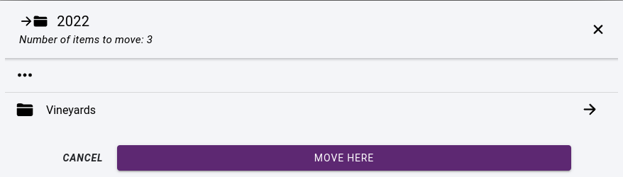
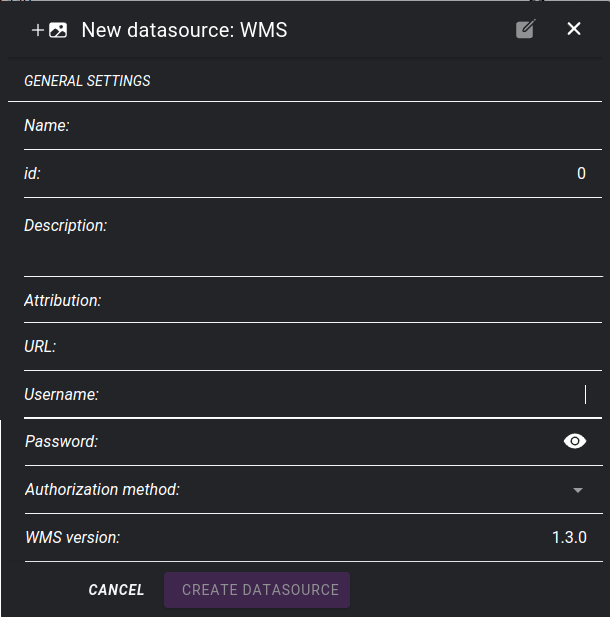

.. _datasources:

Data sources
============

Data sources play a crucial role in GIS map creation. They provide the raw materials for creating maps and are the foundation upon which maps are built.

**Maps can be created using a variety of data formats:**

* Vector data formats: Vector data formats, such as Shapefile and GeoJSON, store data as points, lines, and polyggon shapes and are commonly used for GIS maps.

* Raster data formats: Raster data formats, such as GeoTIFF and JPEG 2000, store data as grids of cells with each cell representing a specific value and are commonly used for satellite imagery and digital elevation models.

* Database formats: Database formats, such as PostGIS, are used to store large amounts of GIS data and provide advanced query and analysis capabilities.

* Web service formats: Web service formats, such as WMS, allow data to be accessed and displayed as a map through a web interface.

**There are many sources for obtaining data to use in GIS maps:**

* Government agencies: Many government agencies make data available to the public for free or for a fee.

* Commercial data providers: There are many commercial data providers that specialize in providing data for GIS mapping, such as Esri and DigitalGlobe.

* Open data portals: Many governments and organizations have established open data portals, which provide access to data for free or for a small fee. Examples include the European Commission's Copernicus program and the U.S. government's data.gov portal.

* Crowdsourced data: Crowdsourced data, such as OpenStreetMap, is becoming increasingly popular as a source of data for GIS maps. This data is generated by volunteers who collect and share data about the world around them.

* Satellite imagery: Remote sensing technology is widely used to capture data about the Earth's surface, including satellite imagery, which can be used as a data source for GIS maps.

* Drone-collected data: It is increasingly popular in GIS applications as it provides fast, cost-effective and accurate data collection options.

* Personal data collection: Data can be collected personally, such as through field surveys, to create custom data sets for use in GIS maps.

Data source administration pages can be accessed from the sidebar: :ref:`Administration->Data Sources<mapadmin>`.

Data source sections
--------------------

Data sources are divided into the following classes:

* File data sources
* Database connections
* WMS services
* External services

    Data source sections

File data sources
-----------------

Usually data sources are available in files. After preparation, they must be in a suitable file format to be imported into the application.

Supported **vector** formats

* ESRI ShapeFile
* ESRi Geopdatabase
* Mapinfo TAB
* Mapinfo MIF
* Autocad DXF
* GeoJSON
* KML

Supported **raster** formats

* TIFF
* JPEG

File structure
--------------

File data sources are organized into folders. The current folder is listed with its subfolders.

    Data source folder contents by opening the usage pop-up window

To create a new folder, click the **+** icon in the bottom right corner, select **Folder** and enter name

    Creating new data source or folder

It is possible to move a data source or folder to another folder using the **MOVE** function. To do this, we first need to select the data source(s) and/or folder(s) to activate the **MOVE** option:

    Selecting datasources, folders

After clicking on the **MOVE** button, we need to select the destination folder and click on button **MOVE HERE**:

    Moving a datasource

Selected datsources can also be deleted by clicking on the Trash icon:

|

.. note:: The trash icon is active only if none of the selected datasources has usage on any map.

Creating a new data source
--------------------------

To create a new folder, click the **+** icon in the bottom right corner and select **Datasource**. A **New datasource** panel will appear with the following fields:

* **Name** - datasource name
* Description - optional description
* **Type** - importing files or content of a folder
* **Format** spatial format
* **Basemap** - whether it should be available as a basemap
* **Files** - UPLOAD files from computer or IMPORT by selecting from the server
* **Projection** - data projection - select from list or enter projection string in **PROJ.4** format
* **Encoding** - encoding of the attribute table
* **Geometry type** - select geometry type for vector data sources

.. tip:: If you need to upload large files, you should upload them via FTP and import them as a data source. This can be particularly important for rasters where the data source usually has many files in a folder.

    Creating new file data source

.. tip:: In the case of vector data, it is recommended to store them in the application's spatial database rather than as files. To do this, select the **ADD TO APPLICATION'S DATABASE** button.

.. _datasource_edit:

Datasource editing
--------------------

It is possible to subsequently change the settings of data sources and perform other operations. To do this, click on **...** at the end of the line and select from the local menu:

* **Edit** - opens data source edit form
* **Delete** - deletes a data source
* **Add to Application's database** - datasource will be available in Application's spatial database as a PostGIS table
* **Add to project** - add data source to a project by creating a new layer

.. figure:: images/datasource_menu.png
    :align: center

    Datsource commands

If you want to add the data source to a project, you need to select the project and target folder:

    Selecting map legend folder

.. note:: If you select in the "add to project" window that the layer should be editable, then the digitization tool, the attribute forms and the attribute table will be available.

Databases
---------

Data sources can also be attached directly from databases. The Application's database is automatically linked to the system. In addition, it is possible to include other databases by specifying connection parameters. These databases must be accessible from the application server machine.

Supported database engines:

* PostgreSQL - PostGIS
* MS SQL Spatial
* Oracle Spatial
* MySQL

    List of databases

It is possible to list the spatial tables of the attached database by clickink on **Layers** in a popup menu.

    List of layers in a database

There is an option to transfer layers to the application database by clicking on the **ADD TO DATABASE** button or add them directly to a project as a new layer by clicking on the **ADD TO PROJECT** icon.

Application's database
----------------------

The application's database stores spatial data in its own PostGIS database as layers.
Layers can be divided into two groups: they can be edited or just used to create maps. Editing layers on the map is done with 2D/3D digitization tools. See section: :ref:`Layer editor <layer_editor>`.
The :ref:`Field editor <field_editor>` allows you to specify how to fill in the attribute table.

    Content of the application's database

Tables can be deleted / renamed if they are not in use on maps.
It is possible to set layers editable by clicking on the **MAKE EDITABLE** button, or adding them directly to a project as a new layer by clicking on the **ADD TO PROJECT** icon.

WMS services
---------------

WMS (Web Map Service) is a standard protocol for serving geospatial data as maps over the Internet. WMS services allow GIS data to be accessed, displayed, and used in a variety of applications and platforms, including web-based GIS applications, desktop GIS software, and mobile devices.

WMS services can be hosted by government agencies, private companies, and academic institutions, and can be accessed for free or for a fee, depending on the provider.

    List of WMS services

In order to be able to use a WMS server in SmartGIS, the access parameters need to be specified. Some WMS services may require a username and password to access the service. These argument are usually provided by the service provider, and is used by the built in WMS client to request maps.

    Adding a WMS service

External map services
---------------------

We can use external services to access map tiles. Then the user's browser as a client communicates directly with the service. External services can only be used as basemaps, they cannot be part of the layers displayed in map legend.

Supported services

* XYZ compatible tile services
* Bing maps

