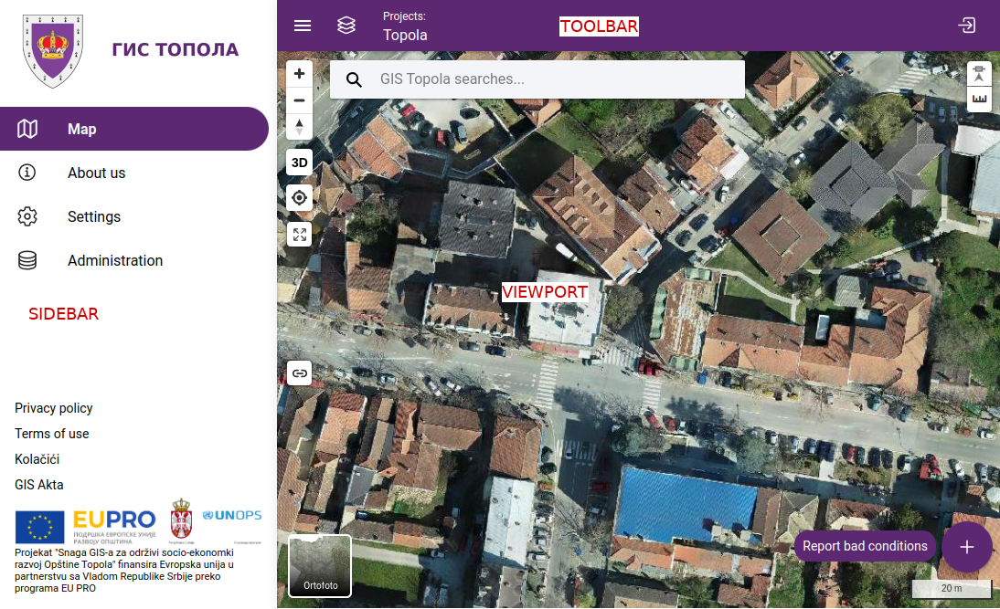
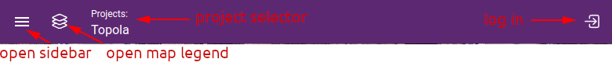
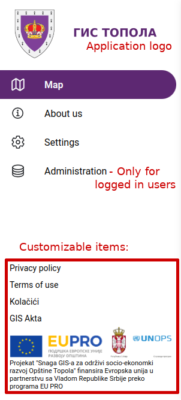

Application interface
=====================
The application interface is providing clear and intuitive navigation and access to key features and tools.

Toolbar
-------

The following functions are available via the toolbar:

    Toolbar

Toolbar items:

* open sidebar
* login / user account
* open map legend
* project selector
* navigation information on administration page

Sidebar
-------

The navigation menu of the application is located here. It contains fixed, context-dependent and freely definable elements.

    Sidebar

Main elements

* application logo
* map viewer
* settings
* administration pages

Customizable items

* about us page
* privacy policy
* terms of use
* cookie consent settings
* custom pages defined by application initialization

Viewport
----------

The start screen of the application is the :ref:`Map viewer <map_viewer>`. Here you can access ready-made maps, integrated point clouds, search functions and digitization tools.
The viewport is used to display the map and access the associated tools.

