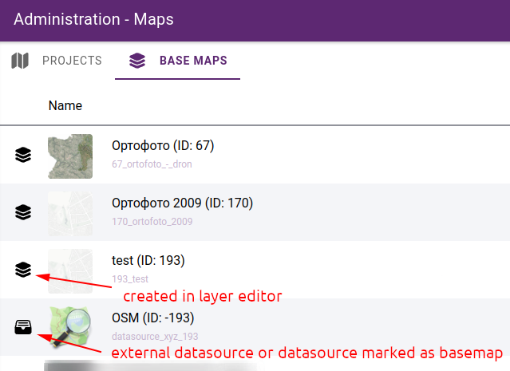
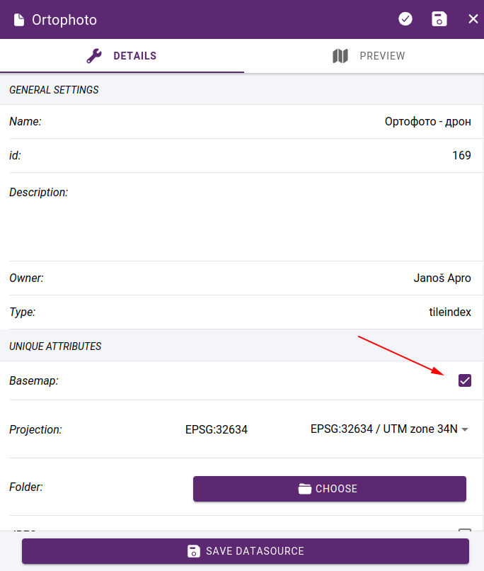
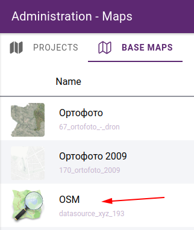
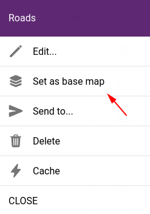
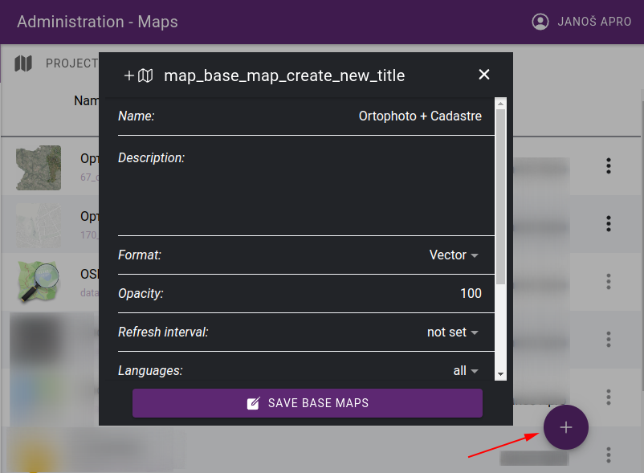
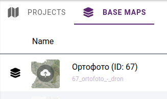
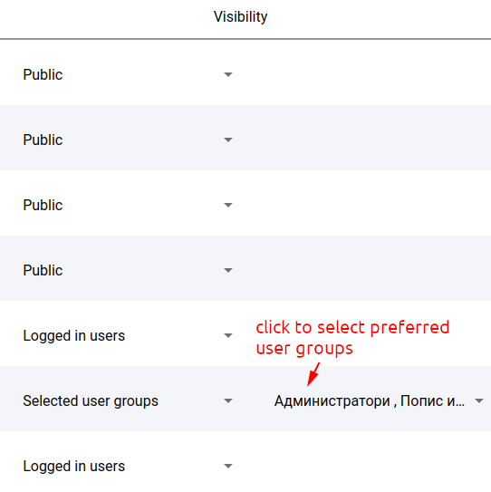
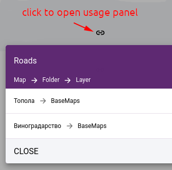

.. _map_basemap:

Basemaps
========

A basemap is a background map that provides context and reference for the data being analyzed and displayed. Basemaps typically include political boundaries, bodies of water, and physical features such as roads, land use, and terrain. They can also include satellite imagery, street maps, or other data layers that provide context and reference for the data being analyzed.

The role of a basemap in a GIS application is to provide a visual representation of the geographic context for the data being analyzed, making it easier to understand the relationships between data and geography. Basemaps can also provide a reference for navigation and help users orient themselves when exploring and analyzing data.

Basemaps are available from Administration > Projects > Basemaps tab:

   Basemap list

Adding basemaps
---------------

Basemaps can be created from data sources in the following ways:

* **Datasource can be marked as basemap on** :ref:`Datasource edit form <datasource_edit>`

   Mark datasource as basemap

* **External data sources always treated as basemaps**

   External datasources are listed in base maps section

* **Set existing layer as basemap** - in the map editor, click on … in the layers row to invoke the layer commands and select *set as basemap*:

   Set layer as basemap

* **Create a basemap layer from the datasource library**

Click on **+** to add new basemap and use the :ref:`Layer creation <layer_creation>` to create a compound basemap from several datasources.

   Create new basemap from datasources

.. important:: Explain the following topics:

Preview image
-------------
Preview images help you to visually identify basemaps more easily. They are displayed in the basemap selector in the bottom left corner of the map:

.. figure:: images/basemap_selector.png
   :align: center

   Preview images in basemap selector

The preview is automatically generated based on the data source(s) that compose the basemap. It is possible to replace the generated image with your own. Simply click on the preview image in the list of basemaps and select the new image:

   Upload preview image

Permissions
-----------

You can also control the visibility of basemaps. This can be important if you want to hide certain basemaps from the public or restrict them to certain teams.

In the basemap list, set the access rights in the **Visibility** column:

* **Public** - available for everyone
* **Logged in users** - available from logged in users
* **Selected user groups** - available to users who are members of one of the selected user groups. If you choose this option, you must select the preferred userg roups in the next column.

   Basemap permissions

Usage
-----

It is possible to list where each basemap is in use. This will give you the maps that are listed as basemaps or as layers in the maplegend:

   Usage panel

Local menu
----------
In basemap listing, click on … at the end of a row to invoke the basemap commands:

* **Edit** - edit basemap in layer editor
* **Delete** - delete basemap. Note that it will only be removed from the base map list if the same layer is on any map.
* **Send to...** - send basemap as layer to a map. In the pop-up window, select the map and the folder where the layer will be placed.
* **Cache** - opens the :ref:`cache manipulation panel<cache_panel>`

   Basemap commands

.. note:: The local menu is only available for layers created in admin, not for data sources marked as basemaps.

