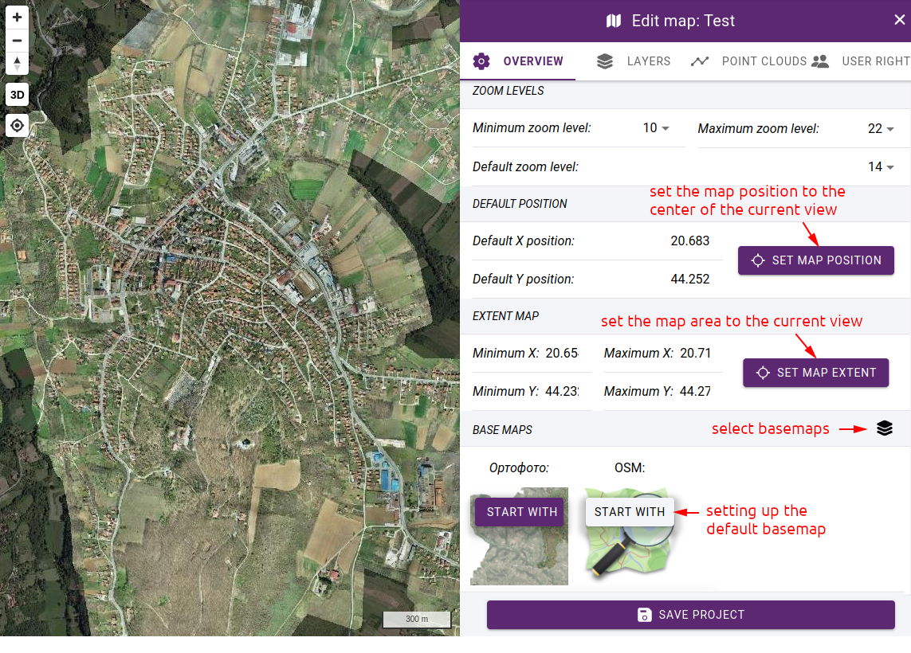

Project building
================

Building a project involves the following steps:

* Creating a new map with basic data and permissions
* Assigning base maps to the project
* Assigning trajectories to the project
* Creating the folder structure of the maplegend
* Creating layers, specifying symbols
* Defining permissions on layers

Map creation
------------

To create a new map, click on **+** in the bottom right corner of the :ref:`project list<project_list>` and fill in the basic data in the pop-up panel:

* **Name** - project's name
* Description - optional description text
* **Visibility** - access rights to the project: *Everyone can access*, *Logged in users only*, *Selected user groups only*. If you choose to allow certain user groups to see the project, a new line will open where you can select the groups.
* Projection - fixed EPSG:4326, due to limitations in the software library that displays the map (MapLibre GL JS)
* **Point cloud projection** - all pointclouds for a project must be in the same projection.

.. figure:: images/map_new_panel.png
    :align: center
    :width: 15cm

    New project panel

After saving, the map editor window opens, which is divided into two parts: the map preview window and the settings window. You can specify additional parameters in the OVERVIEW tab in the settings:

* **Zoom levels** - setting the minimum, maximum zoom level and the default zoom level at which the map starts for users
* **Default positon** - specify the starting position of the map.
* **Map extent** - define the area of the map. The layout also allows you to navigate outside this area, in which case you can use the "Zoom to extent" button to return to the base area. Furthermore, the tilecache generation of layers is limited to the specified area.
* **Basemap selection** - a pop-up panel shows a list of basemaps, from which you can choose which ones should be available on the map

.. note:: The preview window is initially empty, you have to choose basemaps and select one as default, then the basemap will be displayed.

    Editing project details

Trajectory selection
--------------------

If point clouds are to be used, they must be added to the project. You can do this in the POINT CLOUDS tab. All the point clouds that are in the same projection as the one you specified in the OVERVIEW tab under **Point cloud projection** are listed here, grouped by folder. Select the trajectories that should be available in the project.

    Selecting trajectories
