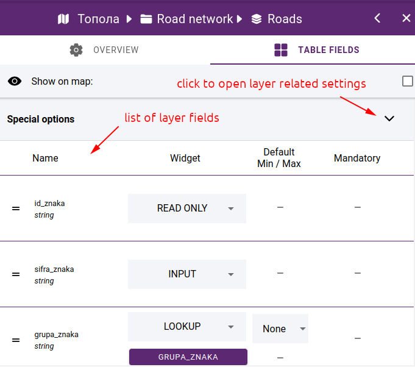
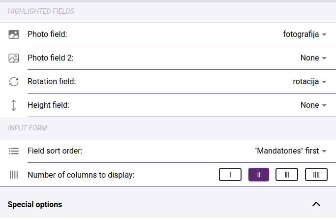
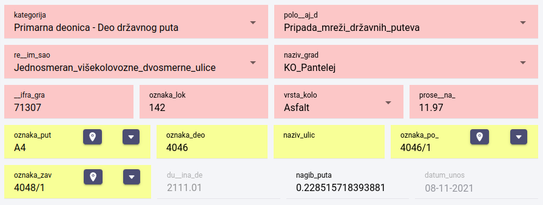
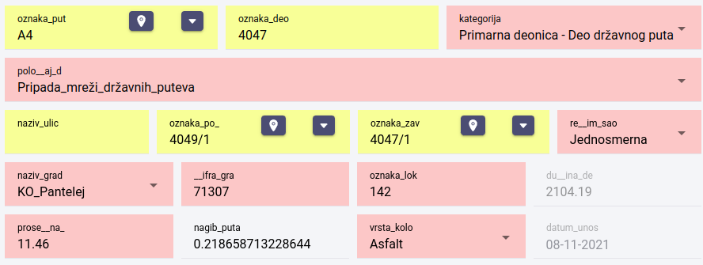
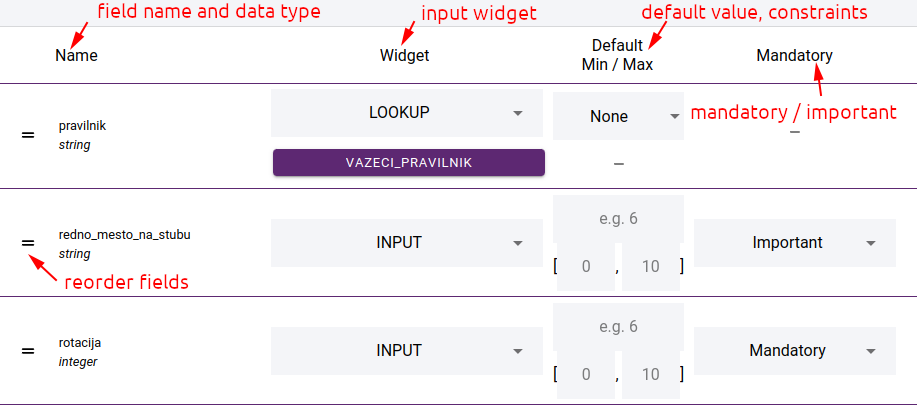
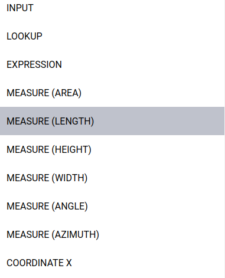

Field editor
============

.. _field_editor:

If the layer is based on a data source that is editable, you can retrieve the attribute table for the layer or the attribute form for each element in the map viewer. In this case, the **TABLE FIELDS** tab will appear in the layer editor, where you can access the settings for the layer fields.

    Layer fields

Special options
---------------

When clicking on Special options, the settings for the layer are displayed:

    Special options

* **Photo field** and **Photo field 2** - in case the layer has a field where the names of the images are stored, this field has to be selected. Up to 2 such fields can be specified. In this case you will be able to add one or two photos on the edit form. If you do not specify such fields, you can add more than one photo to an element.
* **Rotation field** - field containing the rotation value. The selected field will be linked to the point cloud rotation measurement, so the measured value will be immediately included in the field.
* **Height field**  - which field contains the height value. The selected field will be linked to the pointcloud altitude measurement, so the measured value will be immediately included in the field.
* **Field sort order** - the order of the fields on the attribute form. You can choose between **Mandatories first** - in which case the mandatory fields come first and then the rest, or **Sorted order" where the fields appear in the order you set up**.

    Displaying fields - mandatories first (highlighted in red)

    Displaying fields - sorted order

* **Number of columns to display** - specify how many fields to display per line on the form

Field settings
---------------

    Field settings

The data source fields are unlisted. The first column shows the field name and data type. Next, the input widget can be selected, depending on this, the next column shows the settings for the values, e.g. default value, minimum and maximum value. In the **Mandatory** column you can specify whether the field should be mandatory (red background on the input form) or **Important**. Important fields are highlighted in yellow, but are not mandatory.

You can change the order of the fields. To do this, drag the field to the appropriate place using the drag
icon at the beginning of the row.

Widgets
-------

Various widgets are available depending on the data type of the field:

* **input** - general input control
* **lookup** - select value from a lookup table. See more in section :ref:`Lookup tables<lookups>`
* **checkbox** - a toggle control that allows you to choose between two values
* **auto increment** - automatic filling of an integer field
* **expression** - expression derived from field values by mathematical operations, e.g: "`{rotation}  + 90`"
* **measures** - add a measure widget to the field leading to the point cloud measure and fill the field with the measured value.
* **coordinates x, y, z** - fill in field value with feature coordinate
* **geolocate** - during geolocation we look for the nearest element of another layer. To do this, you need to select a data source for the geolocation and a field whose value will be populated into the field.
* **date created** - date/time of feature creation
* **date modified** - date/time of feature change
* **user created** - the user who created the feature
* **user modified** - the user who made the change
* **read only** - read only field
* **hidden** - not visible on feature form

    Widget selection
