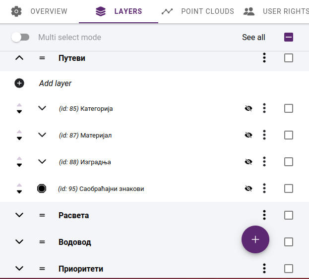
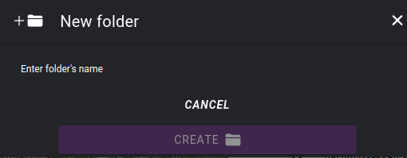
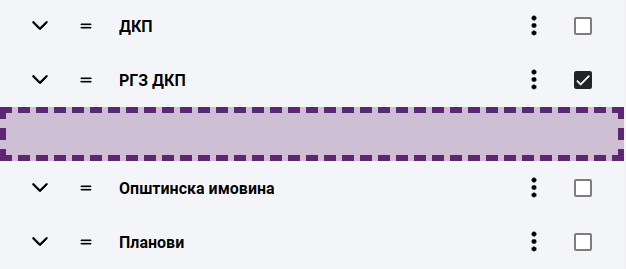
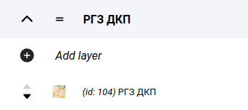

Adding layers to the map
========================

We can fill the map with content in the LAYERS tab of the map editor. Layers are sorted into folders, first you need to create the folders and add the layers in them.

Folders
-------

Layer folders refer to the grouping of map layers into a hierarchical structure, allowing users to easily manage and organize complex maps with multiple layers. In a map legend with layer folders, individual map layers can be organized into folders providing a clear and organized view of the map data.

Layer folders are commonly used to group related map layers, such as all the layers for a particular city or region, or all the layers for a specific type of data, such as transportation, land use, or demographic data.

By organizing map layers into folders, users can turn multiple layers on and off at once, making it easier to compare and analyze different map scenarios. Additionally, layer folders can be expanded and collapsed, allowing users to focus on specific map data as needed.

    Folders

Create folders
--------------

Add a new folder by clicking the **+** button in the lower right corner of the LAYERS panel. Enter the folder name in the pop-up dialog that appears.

    Creating a new folder

Folders can be renamed or deleted at any time, these functions can be accessed by clicking on **...*** in the row of the folder.

.. caution:: The deletion is not limited to those with empty content. If a folder is deleted, its entire contents will be removed. This operation is not reversible.

Reordering folders
------------------

New folders are always added to the end of the list. You can change the order of the folders at any time. Drag the folder to the right place by holding the drag icon at the beginning of the row.

    Moving a folder

Adding a layer to a folder
--------------------------

The first item in the list of all folders is "Add layer". Clicking on it will open the layer editor panel.

