.. _layer_creation:

Layer creation
==============

When creating a new layer, the basic settings and selection of the data source are performed in the opening panel.

.. _rendering_formats:

* **Name** - layer name
* **Description** - optional description
* **Attribution** - optional, when available, it is displayed as copyright text.
* **Format** - rendering formats:
    * Vector (single file)
    * Vector tiles
    * Image tiles
* **Opacity** - layer opacity
* **Language**
* **Legend type**
    * Without - layer will not be on the map legend
    * Single - single symbol
    * List - multiple symbols in case of layer classification
* **Checked on start** - whether it is initially on
* **Info popup** - enable a pop-up window when clicking on an item. Popup content can be customized in :ref:`Info popup<info_popup>` section.

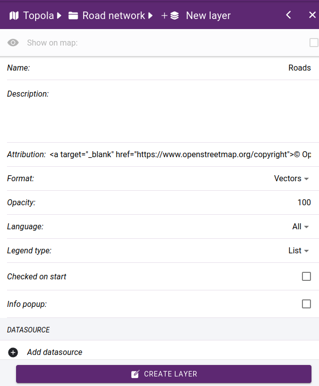

    Basic settings

Datasource selection
--------------------

In this step you have to select the data source from the library, further settings like defining symbols, labels are linked to the data source.

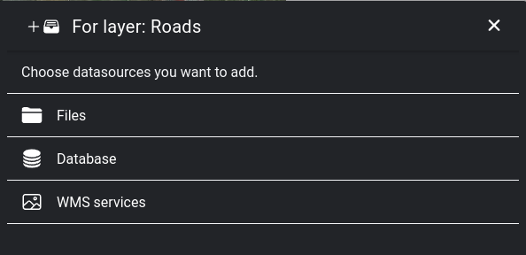

    Browse datasource library

**File geodatabase** - choose from a list of available layers.

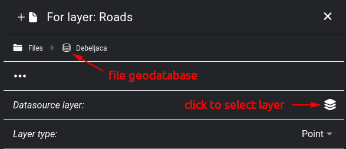

    File geodatabase selected

**WMS service** - connects to the service and retrieves the available layers and which projections and image formats are supported

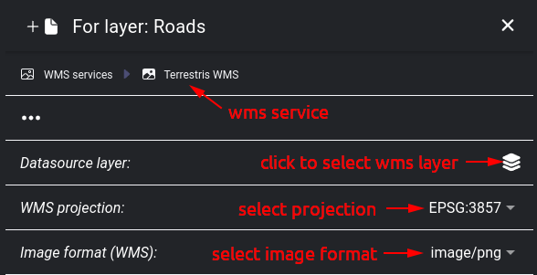

    WMS service selected

**Database connection** - we can choose to connect to a table in a database, or the data source can be based on an SQL query.

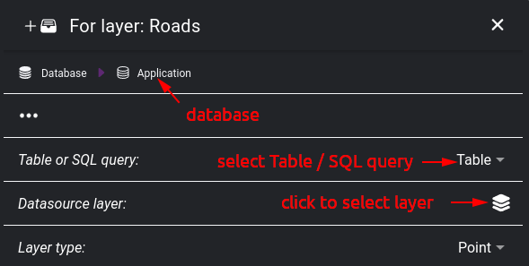

    Database connection selected

.. tip:: It is possible to add multiple data sources to a layer. This is useful for raster base maps when combining e.g. orthophoto with road networks, labels. This option is currently only supported on image tiles, it does not work with vector tiles.

After adding the data source, you need to make additional settings on the layer, which are displayed in tabs.

**General** settings:

* **Name** - name can be show on info popup window
* **Visible** - whether it is visible or hidden.
* **Visible on all zoom levels** - if this option is not checked, we have to select the minimum / maximum zoom levels at which it will be displayed
* **Opacity** - layer opacity (0-100)
* **Symbol scale** - the zoom level at which the default settings apply. For example, for a symbol you can set the parameters Size, Min. size, Max. size. What you specify for Size will be valid at the Default scale, zooming in will increase to Max. size, zooming out will decrease to. Min size.

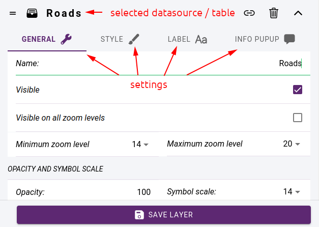

    Datasource related settings

Styling
-------

Styling is the process of adjusting the appearance of various map elements such as markers, lines, polygons, and labels to improve the visual appearance of a layer.

The following styling techniques can be used:

* Adjusting the thickness, opacity, and color of lines and polygons to highlight specific features or show boundaries.

* Changing the color, size, and shape of map markers to differentiate between different types of points of interest or to represent data.

* Adding labels to map elements to provide additional context or information to the viewer.

Styling is done on the **STYLE** tab by specifying styling classes. It is possible to display all elements with the same style, or to create a classification according to an attribute of the data source. Each of the resulting classes must be styled separately.

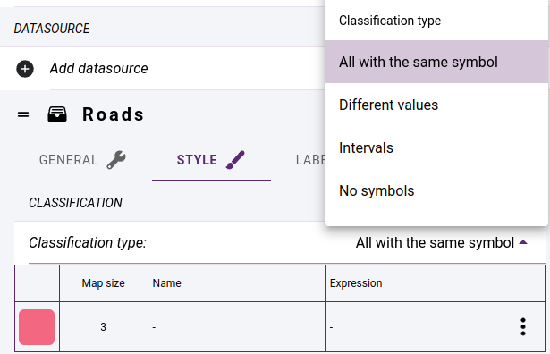

    Layer classification methods

.. tip:: If you want a layer that only has labels, you should select **No symbols** in the **Classification type**.

Clicking on a line of the class will bring up a panel where you can change the name of the class, its expression, and the style parameters.

* Classification based on **different values** - a style class is created for all the different values of the selected **classification field**.
* Classification based on **intervals** - we specify the number of classes, the value range of the selected numeric attribute will be divided into the desired number of intervals. You can do two types of interval mapping: you can create intervals with the same range of values, or you can create intervals with the same number of elements. The classes you create are assigned a generated colour. These can be randomized or you can specify two colours and use a gradient between them to get the others.

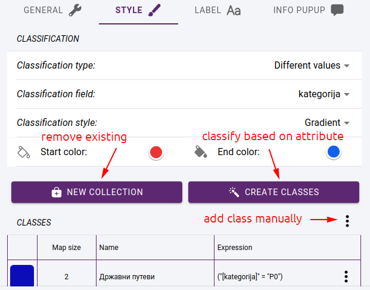

    Layer classification

Click on **CREATE CLASSES** button to create the classes. Each class is given a name and a classification expression that assigns the elements of the layer to the class.

.. tip:: If you use classification, set :ref:`Legend type<rendering_formats>` in the layer settings to **List**. Then the classes will be listed in maplegend under the layer with their names and symbols.

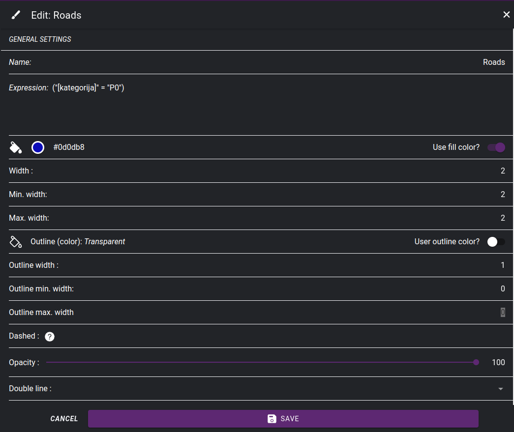

    Setting symbol properties for a class

Labels
------

Labels are typically used to provide names or other relevant information about geographic features such as cities, streets, bodies of water, and points of interest. To create a label, the data source must have an attribute whose values can be written to the map.

First we need to enable the use of labels in the **LABEL** tab:

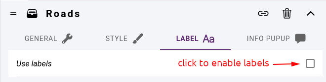

    Enable labels

Label settings:

* **Label field** - the field whose content is displayed as label
* **Angle source** - label angle
    * value - fixed value for all labels, e.g.: 0
    * field - the field containing the angle value
    * follow - the labels are drawn along the lines (only for line layers)
    * expression - a unique expression that can include field names, constants, arithmetic operations
* **Visible on all scales** - whether the label should appear on all scales on which the layer appears. If unchecked, **Min zoom level** and **Max zoom level** must be selected.
* **Font** - select from availables fonts
* **Label size**, **Minimum size**, **Maximum size** - size parameters
* **Use fill color** - whether to use a fill color, color selector
* **Use outline color** - - whether to use an outline color, color selector
* **Position** - label justify relative to feature position
* **Offset X**, **Offset Y** - label offset relative to feature position
* **Force** - force display of label even if it overlaps with others
* **Buffer** - leave blank space around label

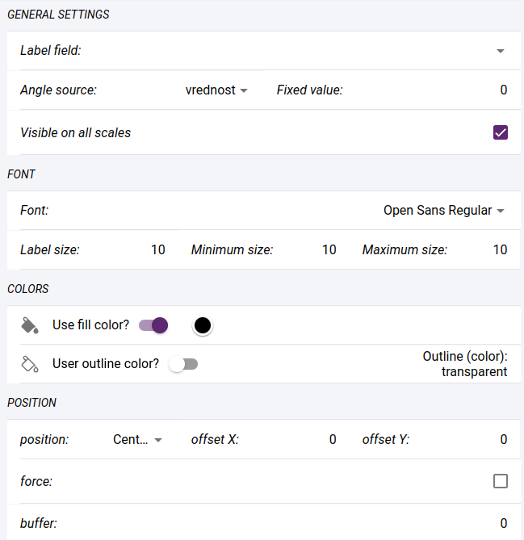

    Label settings

.. _info_popup:

Info popup
----------

You can enable the display of info-popup in the default settings of the layer. When you click on an element of the layer on the map, the corresponding information is displayed in a small popup window. Its content can be specified using a template created in an HTML editor.

The values of the fields in the template are represented by their names between brackets. The field names can be added between pipe symbols (|). There are two special expressions **{layername}** and **{classname}**. These replace the layer and class names respectively.

If the layer is editable and images can be included in the elements, you can insert the main image or an image gallery showing all the images.

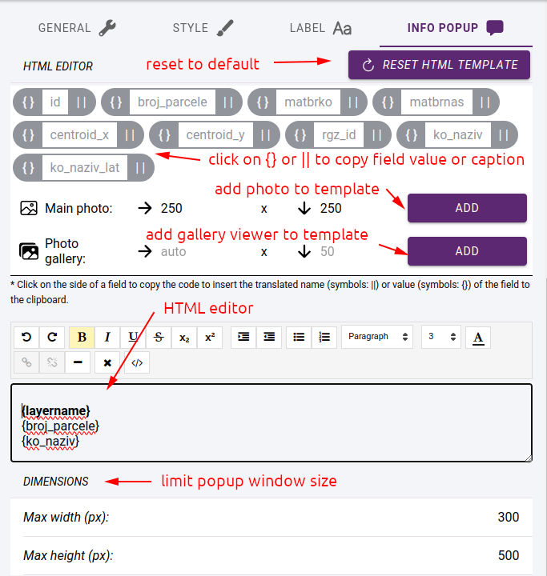

    Info popup settings

.. note:: The info-popup window only appears on the map if the layer is in vector rendering format.