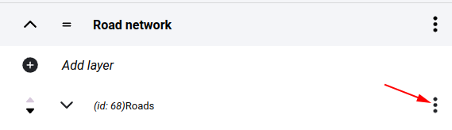

Layer commands
==============

In the map editor, click on **...** in the layers row to invoke the layer commands.

    Layer commands
Edit
-----
Opens layer settings panel

Set as basemap
--------------

Adds the layer to the list of basemaps.

Copy / move layers
------------------

Layers can be moved within a folder by clicking on the up and down arrows at the beginning of the rows.

    Reordering layers

If you want to relocate a layer to another folder you have to use the SEND command.

.. tip:: With the SEND function it is also possible to place your layer on another map. It will be present both in the original folder and in the folder selected on the new map.

    Sending layer to another map

Deletion
--------

When deleting a layer, two cases are possible: if the layer is also in use in another project, it will only be removed from the current folder, but not deleted. If it is only used in this project, an extra warning will be given that the layer will be permanently deleted and this operation cannot be undone.

    Layer deletion

.. _cache_panel:

Caching
-------

The contents of both vector and raster layers are cached by the system. This speeds up map loading because it is not necessary to read the data source every time, but only to transfer the files stored on the server. We use two types of cache one is tile-cache when we divide the area into tiles at each zoom level and file-cache (for vector rendering only) when we store the layer contents in one file. In layer settings, the **raster** and **vector tile** display modes use a tile cache, and **vector** stores the layer contents in a file.

When the contents of the data source are updated, these cached files expire because they were created while the previous state was still active. In this case, they must be overwritten. The system cannot keep track of changes to the contents of data sources because, for example, in the Application Database PostGIS database, a table belonging to a layer can be accessed by external software. In such cases we have to take care of flushing the cache.

With tile cache, when the map client requests an area that is not in the cache, the user has to wait until the server has generated the content based on the data source and placed it in the cache to serve further requests. This can be done in advance by having the server cache the entire tile cache.

In case the cache is in a file, the **Delete cache** option will appear in the commands, in case of tile caches the **Tile cache** option will open a dialog:

* Use extent selection - limit operations to a selected area on the map
* Priority - priority of operations
* Delete cache - empty tiles
* Generate cache - create tiles (note that either Delete or Generate must be selected)
* Re-generate existing tiles - if create is checked then this option overwrites existing tiles, if it is not checked then it skips them.
* On all zoom levels / only on selected zoom levels - limit operation to zoom levels

    Options for creating and deleting tile caches

After saving the tile-cache options, the operations continue in the background and can be followed on the :ref:`Processes<processes>` page.

Multi select mode
-----------------

It is also possible to perform an operation on multiple layers at the same time. These include Move / copy, Delete and Tile cache.
To do this, turn on the **Multi select mode** switch, select the layers and click on the action command icon above.

    Multi select mode commands

