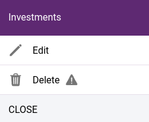

Project list
============

.. _project_list:

In the list, each project is displayed with a preview image in the order we have defined. With the activate/deactivate function you can control whether the project is available in the application, whether it is displayed in the :ref:`map selector<project_selector>`.

    Listing of projects

Preview image
-------------

The preview image for your projects is automatically generated based on the base map and the layers that are initially activated. If you want to represent the project with your own image, you can do this by uploading an image which should be 256x256 pixels in size. Simply click the upload icon on the existing preview image and select the file to upload.

    Upload icon

Reordering projects
-------------------

You can change the order of the projects at any time. Just grab the reorder icon at the beginning of each row and move the row to the desired position.

.. tip:: It's a good idea to switch to compact view to get a better overview of the list of projects and to make it easier to move around.

Editing, deleting projects
--------------------------

Project editing / deleting functions can be accessed by clicking on **...*** in the row. The editor opens even if you click on the project name.

    Map functions

.. caution:: The deletion is not limited to those with empty content. If a project is deleted, its entire contents will be removed. This operation is not reversible.