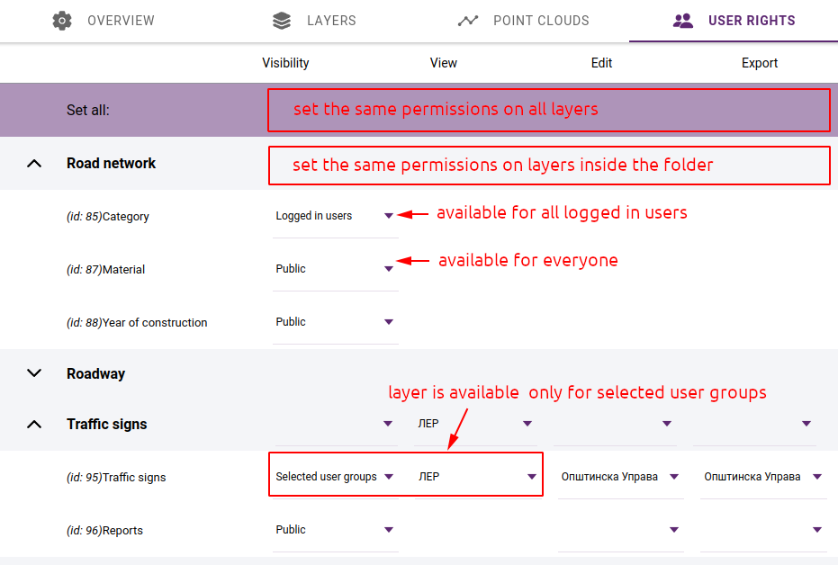
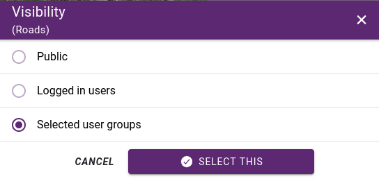

.. _map_permssions:

Permissions
===========

Map layer user permissions represent the level of access and control that each user group has over the data and functionality of each layer within the application. User permissions can be set at the layer level to control who has the ability to view, edit, or export data within that layer:

* **View access** - users can view data within the layer but cannot make any changes or edits.
* **Edit access** - users can modify data within the layer, such as adding or deleting features or changing attribute information.
* **Export access** - users can download the layer in various GIS or tabular formats.

The permissions can be set in the **USER RIGHTS** tab of the map editor. Here you can set the **View** / **Edit** / **Export** permissions for each layer. We can define access rights on user group level.

    User rights

When editing and exporting, you always have to select which user groups are eligible.

.. note:: For the export function, it is not enough that a user belongs to a group that has export enabled. In addition, export must be enabled in general on the :ref:`user's profile<user_panel>`.

For view access, you can choose from the following options:

* **Public** - the layer is public to everyone who has access to the map
* **Logged in users** - available to members of staff with a login account
* **Selected user groups** - specify which user groups it will be available to.

    View access

