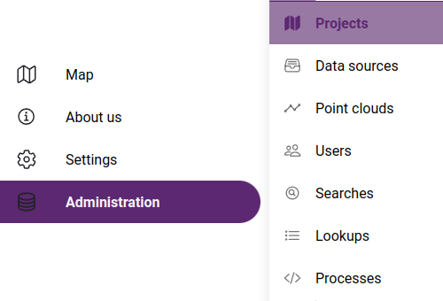

Create your own maps
====================

Map creation involves the process of combining data layers, styling them with colors, symbols, and labels, and arranging them in an appropriate order to create an informative and visually appealing map.

Main steps to provide the data to be displayed on the map:

* Data acquisition: Collecting or acquiring the data to be included in the map, such as demographic data, satellite imagery, or road networks.
* Data preparation: Cleaning and organizing the data, fixing any errors or inconsistencies, and transforming it into a suitable format for use in the GIS application.
* Data projection: Defining the map projection, which is the way the data is represented on a flat surface, such as a computer screen.

Creating maps in SmartGIS involves the following operations:

* Data source collection - Creating a libary from spatial data and cloud resources
* 3D point cloud collection (optional) - Creating a library from point cloud recordings and spherical images
* Map creation: Defining map attributes and access rights, selection of available point clouds
* Laying out the map: Arranging the data layers in an appropriate order and defining the overall appearance of the map, including the title, legend, and scale.
* Data symbology: Defining the symbols, colors, and labels used to represent the data on the map, including the type of symbol, size, and color.
* Interactivity: Adding interactive features to the map, such as pop-up windows and querying of data layers.

.. _mapadmin:

Data and map operations are managed on the administration pages.
These pages are only available to users added within the application, on the :ref:`Team management <users>` page.

   Accessing administration pages

.. toctree::

    datasources
    trajectories
    maps
    lookups
    searches
