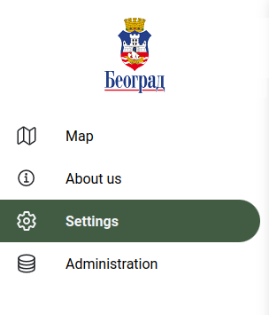
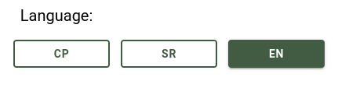
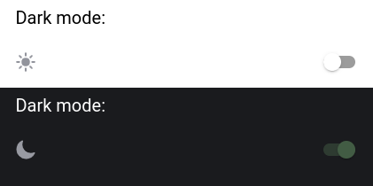
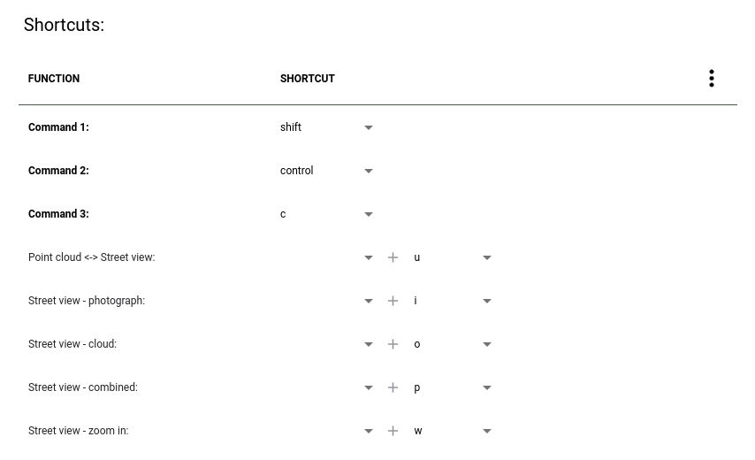

Settings
========

Under settings basic system settings can be changed and set.

Select language
---------------

Application language can be switched between english, serbian, hungarian or other language that is defined in the system.

Dark mode
---------

Dark mode can be turned on or off. When turned on a darker color scheme is used throughout the system to reduce eye strain by darkening the background and reducing contrast with your surroundings.

.. _shortcuts:

Shortcuts
---------

Shortcuts are used frequently when working with gis objects. Default shortcuts can be changed by the users needs.