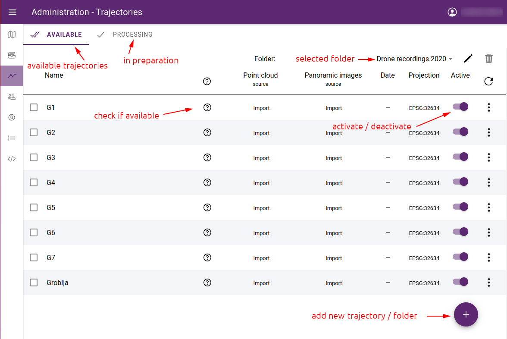
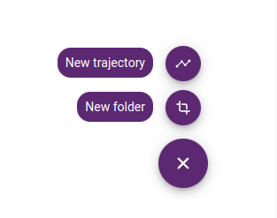
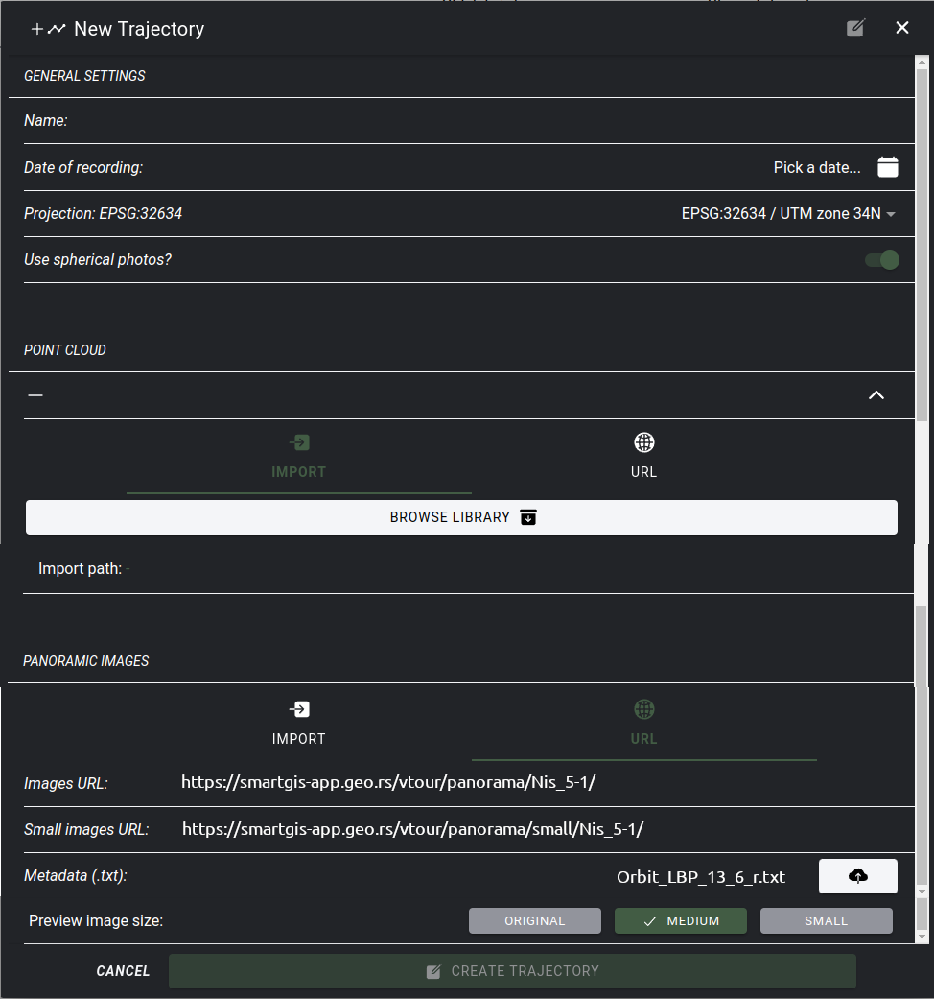
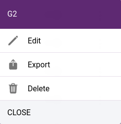
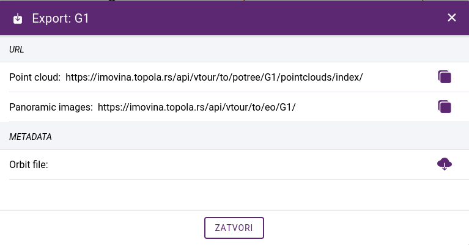
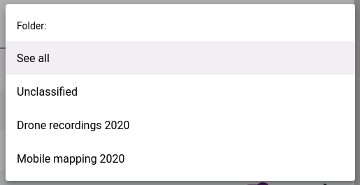
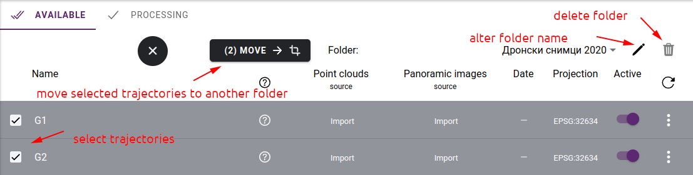
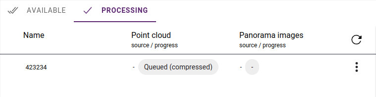

Mobile mapping data
===================

Mobile Mapping is the process of collecting geospatial data from mobile vehicles such as cars, drones, boats, trains or aeroplanes.
In SmartGIS, we can use two types of data generated from Mobile Mapping: **Point clouds** and **Panoramic images**.

A point cloud is a set of points in space that represent the surface of an object.
Two common methods are used to generate point clouds: LiDAR and photogrammetry.
**LiDAR** is a technology that uses lasers in order to measure distances from the sensor on the LiDAR device to objects in the environment.
**Photgrammetry** uses photographs taken from various angles of an object in order to calculate its dimensions and generate a 3D model by using triangulation.
These point clouds can be used in SmartGIS for :ref:`3D digitization <3d_digitizing>` of map objects.

A panoramic photography is essentially a photo with a wide format, whether that's vertical or horizontal. Either way, they are taken by taking a series of photos which overlap to create one single image.

Mobile mapping data is always uploaded via FTP.

.. _pointclouds:

Point clouds
------------

The common file format for point clouds is LAS (or comressed LAZ). LAS files collected in a bundle are called **trajectories**. Such trajectories can be imported into the application packed in **.zip**, **.rar** or **.7z** format.
In the process, the files are unpacked and prepared for web display, which requires the **Potree** format.

The application also accepts point clouds in Potree format, in which case it is only necessary to unpack the archive.

Panoramic images
----------------
In SmartGIS, each panorama image series must belong to a trajectory. The images of the trajectory should also be packed in a **.zip**, **.rar** or **.7z** archive. Such a package should also include a metadata .txt file containing a list of the images. This will include the position of each image and other information.

.. note:: Panoramic metadata is a tab delimited text file with column names in the header which should be:
    **GPS Time, Image Filename, East, North, Height, Omega, Phi, Kappa**

Trajectory administration
-------------------------

Trajectory administration pages can be accessed from the sidebar: :ref:`Administration->Point clouds<mapadmin>`.

The trajectory administration is split into two sections: one for accessible trajectories and another for trajectories undergoing processing. The accessible trajectories are organized into folders, which are also utilized for grouping in both the administrative pages and maplegend panel. The trajectory administration page displays the contents of the selected folder.

    List of trajectories

Create a trajectory
--------------------

To create a new trajectory, click the **+** icon in the bottom right corner, select **New trajectory**.

    Creating a new trajectory or folder

The add trajectory form will appear with the following fields:

* **Name** - trajectory name
* **Date of recording** - date of field data collection
* **Projection** - data projection - select from list or enter projection string in **PROJ.4** format
* **Use spherical photos?** - are panoramic images available for the point cloud?
* **Point cloud** - select archive from (.zip, .rar, .7z) server or enter URL to use hosted point cloud
* **Point cloud URL** - folder URL where **cloud.js** Potree file is located
* **Panoramic images** - select acrhive from server or enter folder URL of hosted images
* **Images URL** - URL of images
* Small images URL - optional URL of small images folder
* **Metadata (.txt)** - upload metadata for hosted images
* **Preview image size** - select if you want to use optimized images

.. note:: In SmartGIS, mobile map data can only be uploaded via FTP.

When you have large images, you can speed up the display by using a lower resolution collection. You can choose to use the **ORIGINAL** or the reduced copy and specify the amount of reduction - **LARGE**, **SMALL**. When reducing the size, the images are also generated in a lower resolution on the server and used in the application. However, if you want to use part of an image, it will always be cropped from the original image.

    New trajectory form

.. note:: After the porcessing is finished (if necessary), the created trajectory will be in the **unlcassified** folder. It will not be available automatically to the application, you need to toggle **Active** to enable it.

The trajectory parameters can be changed later and the point cloud or panoramic images can be replaced. To do this, click on **...** at the end of the line and select **Edit** from the menu that appears.

    Local menu commands

This menu also contains the **Delete** and **Export** trajectory commands. You can only delete trajectories that are not used in projects. Export gives the URL of the point cloud and the panoramic images which can be used in another application, e.g. in another installed SmartGIS instance. In addition to retrieving URLs, it is possible to download a metadata file for panoramic images.

    Exporting a trajectory

Trajectory folders
-------------------

The trajectory screen shows a list of the selected folder. The **unclassified** folder contains those that have not yet been classified. It is possible to get a listing of all trajectories by selecting the **See all** option:

    Folder selection

The name of the selected folder can be changed, and the folder can be deleted if it is empty.
To move trajectories, they must first be selected, and the **MOVE** button appears. Click on it to select the destination folder to move to in a popup panel.

    Folder actions

Processing list
---------------

If trajectories are created from a packed archive, they must first be processed on the server before the application can use them. The following operations may be required:

* **unpacking the archive** - both point clouds and panoramic images should be in a single **.zip**, **.rar** or **.7z** file
* **conversion of LAS files to Potree format** - this step is omitted if we have already unpacked the Potree archive
* **image size reduction of panoramic images** - this step is omitted if ORIGINAL is selected as the display resolution
* **inserting images into database** by processing the metadata file

These operations can be time-consuming and put a heavy load on the server. Therefore, their execution does not start when the trajectory is created, but they are placed in a waiting queue. For information on the status of processing operations, see the **Processing** tab. This list contains the trajectory until the processing is finished.

    Processing status
