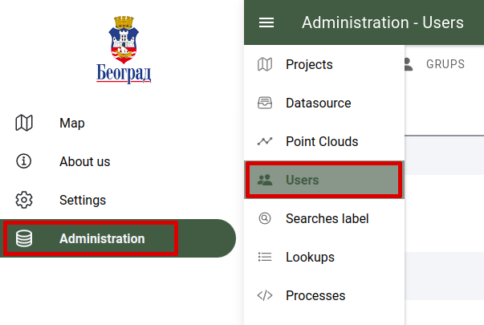
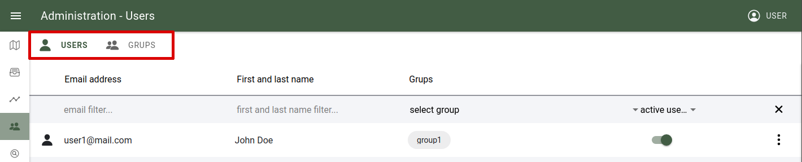
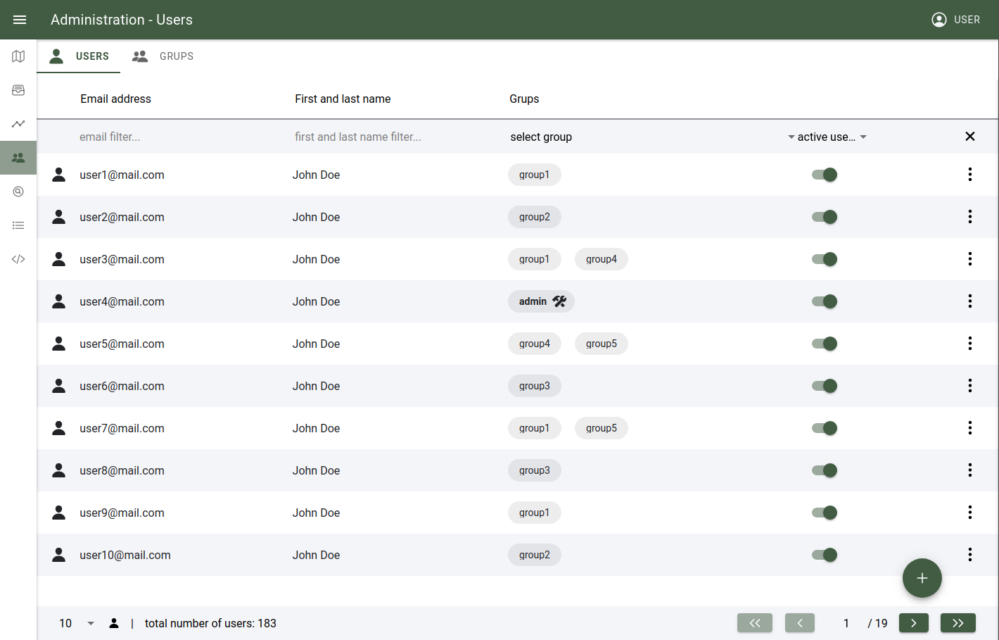
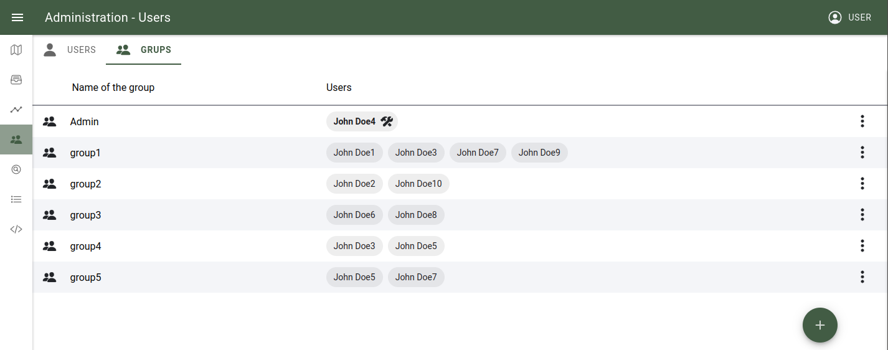
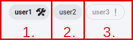

.. _users:

Team management
================

This part is only accessible to registered users with an administrative permissions. It can be reached after login, in the main menu select "Administration" then "Users".

The two main function groups "Users" and "Groups" are sorted in tabs.

    Users and groups

Users
-----
.. _user_panel:

System users can be created, edited, user groups can be attached or detached from users, and users can be activate or deactivate.

    List of users in the system

Actions:

* Create new user: A new user can be created when the "+" button is pressed on the right botton corner.

    .. figure:: images/users_addnew.png
        :align: center

        Create new user

    * Default data tab:

        * Email: Email of the user must be set.
        * Active: User can be saves as active or inactive, incative users cant log into the system.
        * Password: Password and confirm password must be set.
        * Name and surname: Name and last name of the user must be set.

    .. figure:: images/users_newuser_defaultdata.png
        :align: center

        Create new user, default data tab

    * Groups tab:

        * Groups: Existing groups are listed and can be attached to the user. A user can be attached to multiple groups, it can be a group member or an administrator of the group.

    .. figure:: images/users_newuser_groups.png
        :align: center

        Create new user, groups tab

.. _users_role:

    * Role tab:

        * Various permissions can be set to the user like:

            * Using FTP folders (When turned on data can be uploaded on datasource, data sturcture can modified and the FTP folder can be used)
            * Prohibit access to the admin pages (When turned on the administration menu and its submenus cant be reached)
            * Export data (When turned on data can be exported from the system)

    .. figure:: images/users_newuser_role.png
        :align: center

        Create new user, role tab

    * When all parameters are set the user creation can be finished by pressing the "Create" button or to cancel it the "Cancel" button.

* Edit user: User can be edited when at the end of the row "more option" and "edit" button is pressed. To close the panel press the "Close" button.

    .. figure:: images/users_edit.png
        :align: center

        More options panel

    When the user is edited, user data is displayed on the sidepanel which is opened on the right side. User data like default data, groups and roles can be edited and saved.

    .. figure:: images/users_newuser_edituser.png
        :align: center

        Edit user panel

Groups
------

Groups are used to regulate the users permissions in user management. When a user has admin permission in a group, it can create new users, edit others in the same group or in the attached groups. As a group member, only those users will be listed where the user is attached as group member.

    List of groups in the system

.. note:: For example when user1 is attached to group1 as administrator, it can create or edit users in group1.

.. note:: For example When user2 is attached to group2 and group3 as group member, to user2, only users of group2 and group3 will be listed as ready only.

User statuses can be:

#. Administrator of the group
#. Active member of the group
#. Member of the group but user is inactive

    Statuses

Actions:

* Create new group: A new group can be created when the "+" button is pressed on the right botton corner.

    .. figure:: images/users_addnewgroup.png
        :align: center

        Create new group

    Group name is mandatory, to create the group press the "Create" button, to cancel the action press the "Cancel" button.

    .. figure:: images/users_newgroup.png
        :align: center

        New group popup

* Edit or delete group: Group can be edited or removed, when at the end of the row "more option" and "edit" or "remove" button is pressed. To close the panel press the "Close" button.

    .. figure:: images/users_editgroup.png
        :align: center

        More options panel

    .. note:: Only empty groups (groups without users attached to it) can be removed.