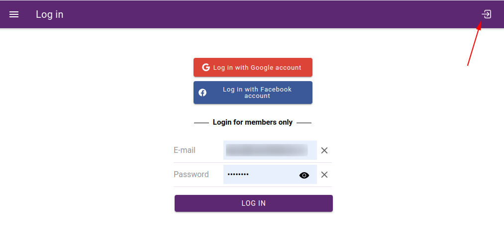

Map viewer
=======

Map viewer ...

.. tip::
https://docs.nextgis.com/docs_ngweb/source/webmaps_client.html

Login
-----

Users can log in by entering their email address and password. Users are registered on the administration page by an administrator.
When configuring the application, it is possible to allow users to log in with a Google or Facebook account. This should be used when setting up WebGIS portals where external users can access certain services, e.g. reporting bugs, posting comments, etc.

   Login screen

Project selection
-----------------

.. figure:: images/SU-select-project.jpg
   :name: select_project
   :align: center
   :width: 30cm

   Project selection screen

Basemaps
--------

Viewport
--------

.. tip::
tool icons description

Map legend
----------

