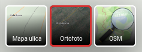
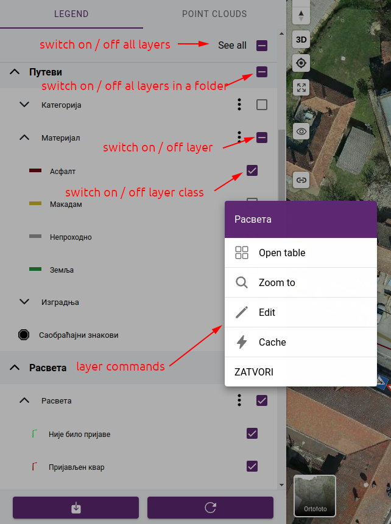
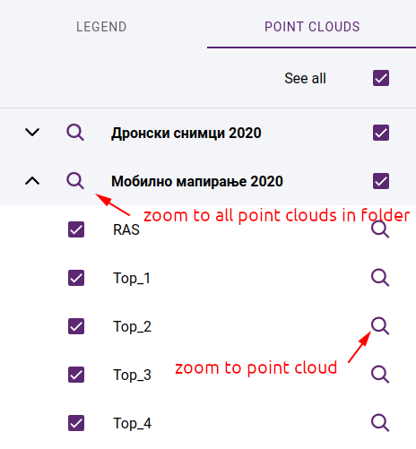
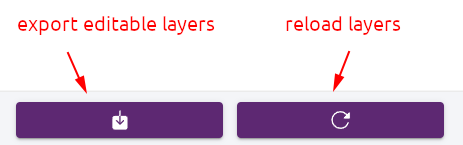
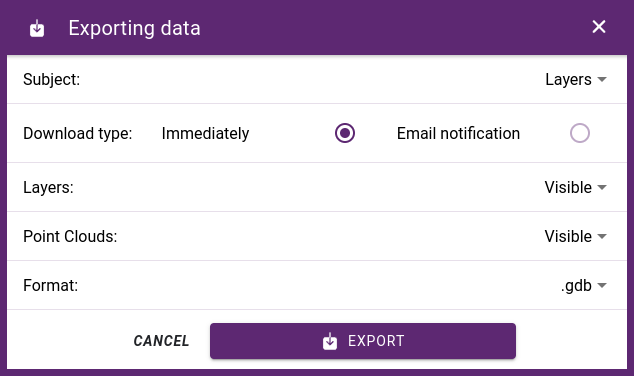

.. _map_viewer:

Map viewer
==========

A user-friendly interface that is easy to navigate and allows users to view and interact with maps in real-time. It has the ability to display multiple layers of geospatial data, such as satellite imagery, street maps, and demographic data.

Main features

* Tools for zooming in and out of maps and panning to different areas of interest.

* Functions for searching for specific locations or addresses, as well as tools for navigating maps using tools such as a compass or a scale bar.

* Interactive features such as pop-up windows, highlighting, and querying of data layers.

* Ability to share maps with others by sharing a link to the map viewer.

* Compatibility with mobile devices, allowing users to view maps on-the-go using smartphones and tablets.

* Secure access to the map viewer, with options for user authentication and authorization.

Working with projects
---------------------

The maps created in the administration interface are called projects.
Access rights can be granted to projects and the layers on them.
This allows to control, for example, whether a map or its layers should be public or which teams can edit the content of certain layers
(digitizing, edit attributes, upload images / attachments).

As a first step, the project selection screen will appear.
You can call this up later using the project selector in the toolbar.
After loading the selected project, the map viewer will be initialized.

.. figure:: images/SU-select-project.jpg
   :name: select_project
   :align: center

   Project selection screen

Viewport
--------
A large area dedicated to displaying the map and its data layers, taking up the majority of the application window.
It contains toolbars and menus that provide access to the map's various functions and tools, such as zooming, panning, measuring, digitizing.

.. tip:: tool icons description - Endre

Basemap selector
----------------
A basemap is a background map that provides context and reference for the data being analyzed,
making it easier to understand the relationships between data and geography.

Basemaps can be assembled in map editor or added from public services like OpensStreetmap tiles or WMS services - see :ref:`Basemap administration <map_basemap>` section.

If multiple basemaps are assigned to a project, you can switch between them using the basemap selector.

   Basemap selector

Map legend
----------
The map legend list available layers for the current project, displays the symbology used for each data layer and allows users to turn layers on and off.
Layers can be switched on and off at several levels:

* switch on/off all layers on the map
* switch on/off all layers in a folder
* switch on/off a layer
* switch on/off a layer class

.. tip:: Vector layers can be classified by attribute, and these classes are also shown in the map legend. It is possible to display only the features belonging to the selected classes.

   Layers

The layers pop-up menu contains the following commands:

* Open table - opens attribute table. Available only for editable layers.
* Zoom to - zooms to the layer's extent. Available after the layer has been loaded.
* Edit - navigates to :ref:`layer editor<layer_editor>` page. Available for users with edit permissions on the selected layer.
* Cache - opens the :ref:`cache manipulation panel<cache_panel>`. Available for users with edit permissions on the selected layer.

If point clouds are attached to the project, the map legend will be extended with a list of available point clouds. In addition to toggling point clouds on and off, you can zoom in on the area they cover, or zoom in on the area of all the point clouds in a folder.

   Point clouds

At the bottom of maplegend are the export and reload layers functions

   Export / refresh

Export data
-----------

Export of layered data in various GIS and tabbed formats is possible:

* .shp - ESRI ShapeFile
* .gdb - File Geodatabase (GDB)
* .dxf - Autocad DXF
* .csv - Comma Separated list (CSV)
* .xlsx - MS Excel

.. note:: Formats .csv and .xlsx are exporting only the attribute table without spatial data.

In addition to the layer data, it is also possible to export the assigned images and attachments.
You can choose to export all or only the active layers.
If point clouds are available, it is possible to limit the export to the area covered by the point clouds that are connected.

.. note:: Export is available only for logged in users. Only those layers are exported for which the user has export permission. The permissions can be set by the project owner or an administrator on the :ref:`map administration pages<map_permssions>`.

Since we can export a lot of large layers, exporting can take some time. To avoid waiting for the result, you can choose the notification option. In this case, we can continue working and receive a notification email with a download link after the export is complete.

   Layer export dialog
